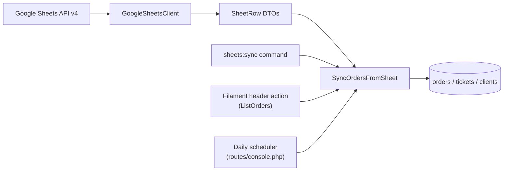

# Google Sheets Sync

One-way sync that imports orders, tickets, and clients from a Google Sheets spreadsheet into the database.

## Architecture



| Component | Path |
|-----------|------|
| Google Sheets client | `app/Integrations/GoogleSheets/GoogleSheetsClient.php` |
| Row DTO | `app/DTOs/SheetRow.php` |
| Result DTO | `app/DTOs/SyncResult.php` |
| Sync action | `app/Actions/SyncOrdersFromSheet.php` |
| Artisan command | `app/Console/Commands/SyncFromSheet.php` |
| Filament action | `app/Filament/Resources/Orders/Pages/ListOrders.php` |
| Scheduler | `routes/console.php` |
| Config | `config/google.php` |

### Entry points

1. **CLI** -- `php artisan sheets:sync`
2. **Filament** -- "Sync from Sheet" button on the Orders list page (rate-limited to once per 30 seconds via cache).
3. **Scheduler** -- `Schedule::command('sheets:sync')->daily()` in `routes/console.php`.

## Change Detection

Each row is fingerprinted with `md5(implode('|', array_map('trim', $row)))` and stored as `sheet_row_hash` (varchar 32, nullable) on the `tickets` table.

On every sync run, existing hashes are bulk-loaded in a single query:

```php
Ticket::query()
    ->join('orders', 'tickets.order_id', '=', 'orders.id')
    ->pluck('tickets.sheet_row_hash', 'orders.folio')
    ->toArray();
```

Per-row comparison in PHP:

- **Hash matches** -- skip (no DB writes).
- **Hash differs** -- update order + ticket.
- **Folio missing** -- create order + ticket + client.

## Data Mapping

| Column | Index | Model | Field | Notes |
|--------|-------|-------|-------|-------|
| Folio | 0 | Order | `folio` | Normalized (see below) |
| Device | 1 | Ticket | `device` | Falls back to `"Unknown"` |
| Client Name | 2 | Client | `name` | Used for dedup |
| Phone | 3 | Client | `phone` | Split on `/,` for dedup |
| Date | 4 | Order | `received_at` | Parsed as `d/m/Y`, fallback `strtotime` |
| Description | 5 | Ticket | `description` | |
| Serial/Email | 6 | Ticket | `device_serial` | |
| Password | 7 | Ticket | `device_password` | Stored via `encrypt()` |
| Observations | 8 | Ticket | `observations` | Also used to infer `status` and `location` |

### Status/Location inference

`regexInfer()` pattern-matches the observations text (Spanish keywords) to set `status` and `location` on the ticket. Default: `pending_diagnosis` / `shop`.

## Technical Gotchas

- **First 4 rows skipped**: filter row, headers, 2 blank rows. If the sheet structure changes, update `slice(4)` in `GoogleSheetsClient`.
- **Folio normalization**: `1.598` becomes `1598` (strip period when all remaining chars are digits). Non-numeric folios like `3600N` are preserved as-is.
- **Empty folio**: rows with no folio get a synthetic one (`IMP-1`, `IMP-2`, ...) per sync run.
- **Password hashing**: the hash is computed from the plaintext password column, so change detection works without decrypting stored values.
- **Client dedup order**: phone segments (split on `/,`) searched via `LIKE` first, then exact name match, then create new.
- **One ticket per order**: `$order->tickets()->first()` is used on update. If multi-ticket orders appear later, this needs revisiting.
- **Sheet always wins**: all synced fields are overwritten on update, including status/location (re-inferred from observations).
- **Audit trail**: `update()` calls fire normally, so `owen-it/laravel-auditing` records every sync change.
- **Chunked transactions**: 100 rows per batch inside `DB::transaction()`. Row-level errors are caught and logged individually without aborting the batch.

## Configuration

Required environment variables:

```env
GOOGLE_SERVICE_ENABLED=true
GOOGLE_SERVICE_ACCOUNT_JSON_LOCATION=storage/app/google-service-account.json
GOOGLE_SHEETS_SPREADSHEET_ID=<spreadsheet-id>
GOOGLE_SHEETS_SHEET_NAME="Hoja 1"
```

The service account JSON file must exist at the configured path. Share the Google Sheet with the `client_email` address found in that JSON file (read-only access is sufficient).

## Debugging

- Errors logged to `storage/logs/laravel.log`.
- Row-level warnings include `folio` and `index` keys.
- Run `php artisan sheets:sync` manually to test.
- Check last successful sync: `cache('sheets:last_synced_at')`.
